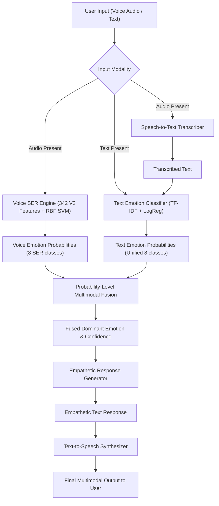

# 🏛️ VIORA — Multimodal System Architecture

---

## 📌 1. Pipeline Overview

VIORA processes multimodal input (audio speech and/or text messages) through a unified end-to-end pipeline:

---

## 🔄 2. Shared 8-Class Emotion Mapping

To fuse text and voice predictions cleanly, raw text labels are mapped to VIORA's shared 8-class SER emotion space:

| Shared SER Category | SER Voice Input | Text Category Input | Handling & Unification Rule |
| :---: | :---: | :---: | :--- |
| `angry` | `angry` | `Anger` | Direct mapping |
| `calm` | `calm` | — | Acoustic-primary baseline class |
| `disgust` | `disgust` | `Disgust` | Direct mapping |
| `fearful` | `fearful` | `Fear` | Direct mapping |
| `happy` | `happy` | `Joy`, `Love` | **Special Case**: `Love` maps to positive valence class `happy` while preserving raw `"Love"` in metadata |
| `neutral` | `neutral` | `Neutral` | Direct mapping |
| `sad` | `sad` | `Sadness` | Direct mapping |
| `surprised` | `surprised` | `Surprise` | Direct mapping |

---

## 🧮 3. Multimodal Probability-Level Fusion Engine

The fusion module (`fusion/emotion_fusion.py`) combines probability vectors:

$$P_{\text{final}}(e) = w_{\text{voice}} \cdot P_{\text{voice}}(e) + w_{\text{text}} \cdot P_{\text{text}}(e)$$

- **Modes**:
  - `voice+text`: Both modalities active ($w_v=0.5, w_t=0.5$).
  - `voice_only`: Only audio provided ($w_v=1.0, w_t=0.0$).
  - `text_only`: Only text provided ($w_v=0.0, w_t=1.0$).
  - `fallback_uniform`: Neither provided (uniform baseline distribution, default `neutral`).

---

## 💬 4. Empathetic Conversational Response System

The response engine (`text/response_generator.py`) generates supportive, non-medical dialogue:
- **Tone & Safety Constraints**: Avoids diagnostic language ("depressed", "disorder"). Uses non-medical framing ("It sounds like you may be feeling...").
- **Offline Generator**: Integrated template response bank across all 8 emotion classes.
- **Online Generator**: Google Gemini API (`gemini-1.5-flash`) integration when `GEMINI_API_KEY` environment variable is set.
